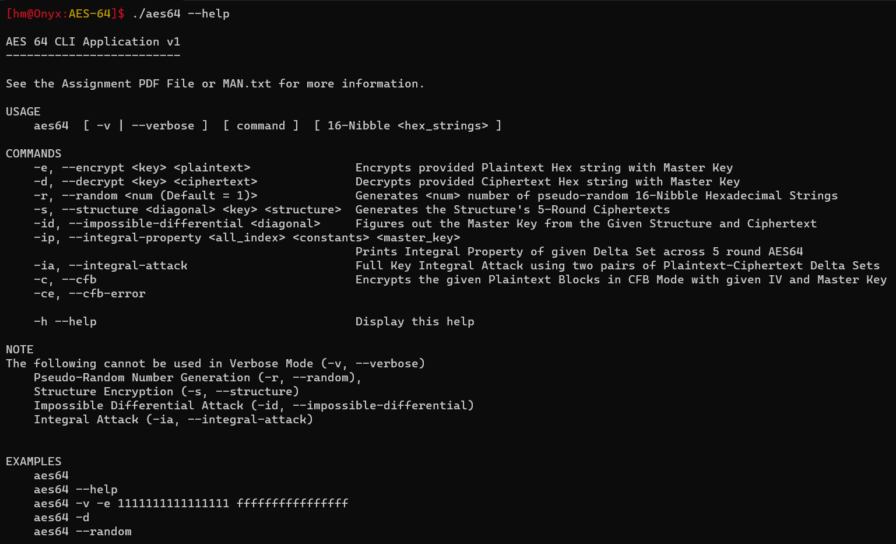

# AES64
AES64 is a bit-reduced version of AES128 which has similar components like MixColumns, SubBytes, ShiftRows like AES128 except the Block and Key States are reduced to 64 bits. This is done to make it more practical to do cryptanalysis and understand the flow of the attacks.
### Design
- [AES64 Components](https://highgroundmaster.github.io/AES64/docs/Design/AES64%20Components.html)
- [Encryption and Decryption](https://highgroundmaster.github.io/AES64/docs/Design/Encryption%20and%20Decryption.html)

### Cryptanalysis
- [Impossible Differential Attack](https://highgroundmaster.github.io/AES64/docs/Cryptanalysis/Impossible%20Differential%20Attack.html)
- [Integral Square Attack](https://highgroundmaster.github.io/AES64/docs/Cryptanalysis/Integral%20Square%20Attack.html)

### Mode of Operations
- [CFB and CFB Error Propagation](https://highgroundmaster.github.io/AES64/docs/Cryptanalysis/CFB%20and%20CFB%20Error%20Propagation.html)
---

## Python Notebook
The Python Notebook `AES_64.ipynb` folder is used to generate the following things
- AES64 Components
  - Mix Columns Look Up table using the Irreducible Polynomial
---
## Application Usage
- You can then execute the code by first compiling `aes64.c` the following way

```bash
gcc -g aes64.c -lm -o aes64
```
One may then execute the executable file with hrlp to learn the usage

```bash
./aes64 --help
```


