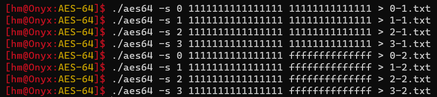
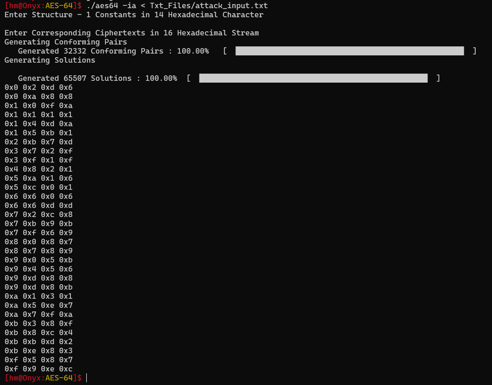
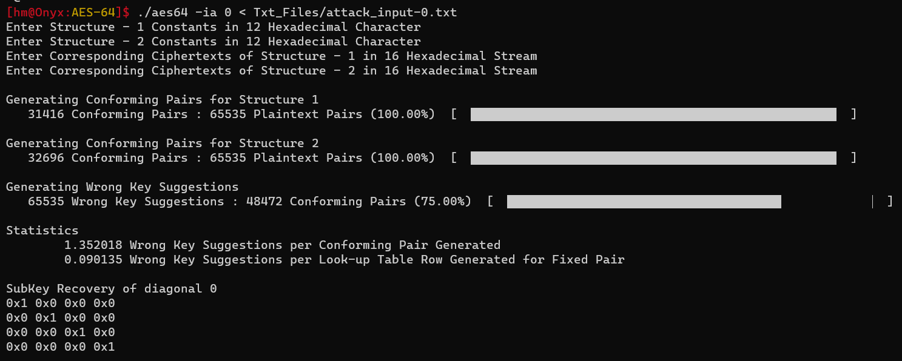
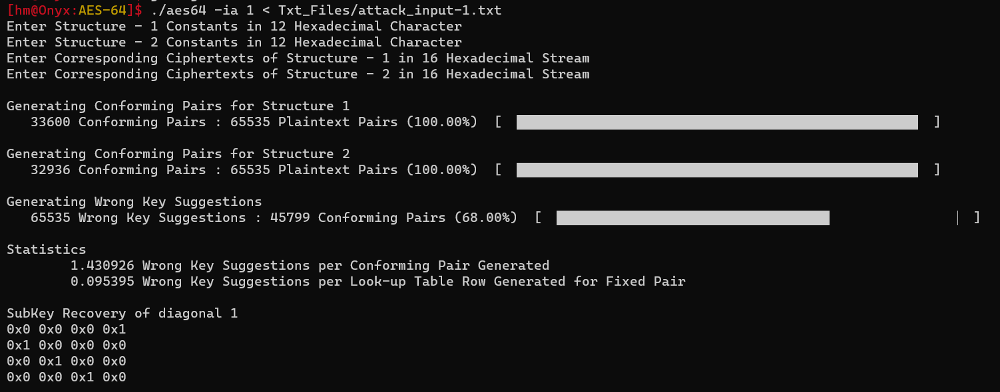
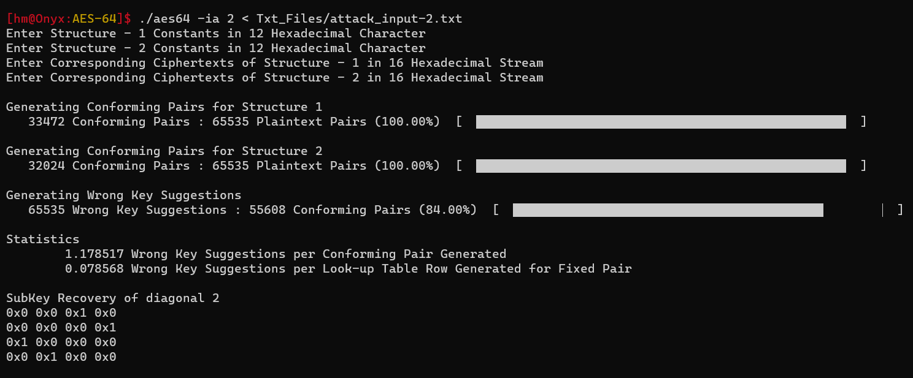

# AES64 - Impossible Differential Attack
## Querying Structures
- Before we start the attack, we will need to query atleast 2 structures to get its corresponding ciphertexts based on a master key as per the above calculations we will need 2 structures to exhaust all the wrong key suggestions
- We will also need to do this operation thrice to get the three diagonal sub-key values
$$
\begin{array}{c}
d = 0 \implies sk_0[0,5,10,15] \\
d = 1 \implies sk_0[1,6,11,12] \\
d = 2 \implies sk_0[2,7,8,13] \\
d = 3 \implies sk_0[3,4,9,14] \\
\end{array}
$$
- We have generated two Structures with master key and the constants for the structures being the following
  

```bash
aes64 -s <diagonal> <master_key> <structure_constants> > structure.txt
```
```
0x1, 0x1, 0x1, 0x1      0x1, 0x1, 0x1, 0x1      0xf, 0xf, 0xf, 0xf
0x1, 0x1, 0x1, 0x1      0x1, 0x1, 0x1, 0x1      0xf, 0xf, 0xf, 0xf
0x1, 0x1, 0x1, 0x1      0x1, 0x1, 0x1, 0x1      0xf, 0xf, 0xf, 0xf
0x1, 0x1, 0x1, 0x1
```

- The All property Nibbles are generated over the diagonal given diagonal. Once the 5 round encryption is done using the master key we may start our attack.
---
## Impossible Differential Attack
- For the attack we will just need to provide the Structure Constants for the two Structures like before and their corresponding ciphertexts which we generated before. We won't be providing master key as we need to recover that.
```
aes64 -ia <diagonal> < attack_input.txt
```
- `attack_input.txt` contains the 2 Structure's 12-hexadecimal constants stream and then the corresponding ciphertexts.
- It first generates conforming pairs - for two structures the expected pairs combine would be i.e - $2^{N+15} = 2\times 2^{1+15} = 2^{16} = 66,536$ pairs.
- After generating the Conforming Pairs from the two Structures and Corresponding Ciphertexts, we then try to find the solutions for the LuT and the Initial State $(\Delta S_1^{\text{I}}, T[i])$.
- After we get the solutions for each LuT Row, we will try different combinations of the Solutions and correspondingly check the Counter for wrong key Suggestions.
- With one Structure, we are will be able to disqualify at the following expected amount.
$$
\begin{split}
&\approx2^{16}\times \left[ 1-  \left(\frac{1}{e}\right)^{2^{N+3}}\right]\\
&\approx 2^{16}\times \left[ 1-\left(\frac{1}{e}\right)^{2^{0+3}}\right]\\
&\approx 2^{16} \times 0.99966\\
&\approx 65,514
\end{split}
$$
- For the given example, if we take just one structure it was able to do $65,507$ sub-key suggestions.
  


- With two structures, it can completely eliminate the entire key space like in the below examples.
  
  
  

- As we can see in the image, after removing wrong key suggestions, it was able to get $[1,1,1,1]$ sub-key as well which is true as our masterkey is $1111111111111111$.
- We did the same attack for 3 diagonals as mentioned above and we can 12 nibbles of master key.
---
## Wrong Sub-Key Counter
- For the Wrong Sub-Key Counter we have used a Bit Array where every bit acts like a Sub-Key index.
- To access every bit in a byte, two functions are coded for setting and getting the value at a particular index inside \textbf{\texttt{aes\_io.h}} Header file.
```c
void set_bit(Nibble * counter,  int key_index)
{
    counter[key_index / 8] |= 1 << (key_index % 8);  // Set the bit at the k-th position in Counter[i]
}

int get_bit(Nibble * counter,  int key_index )
{
    return ( (counter[key_index / 8] & (1 << (key_index % 8) )) != 0 ) ;
}
```
- Hence we will only need $2^{16}/8 = 2^{13}$ Bytes to allocate this counter.
---
