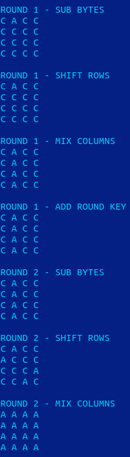
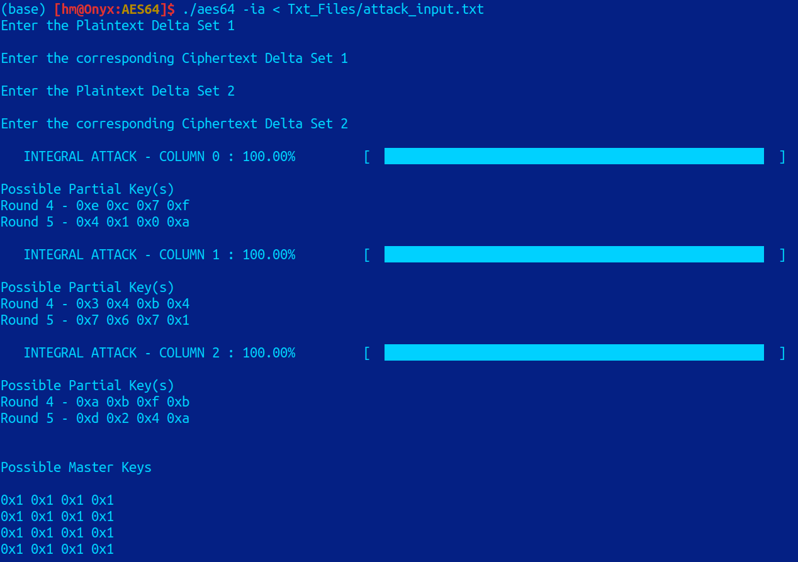

# AES-64 - SQUARE Attack

## Integral Property

- To get the integral property of a Delta Set $\Delta$ you can use the $C$ CLI program
    
    ```bash
    aes64 --integral-property <all_index> <constants> <master_key>
    ```
    
    - `<all_index>` - The index of the Cell containing ALL $(\mathcal{A})$ property.
    - `<constants>` - The values of CONSTANT $(\mathcal{C})$ property cells excluding the ALL property cell
    - `<master_key>` - The key for encrypting for $5$ Rounds using $\text{AES}64$
- You can also use `--verbose` optional argument to get all the Plaintexts in $\Delta$ for every operation
    
    ```bash
    aes64 --verbose --integral-property <all_index> <constants> <master_key>
    ```
    
- You can provide the All Index, Constants or Master Key later on as well by using the following command
    
    ```bash
    aes64 -ip
    ```
    



Integral Property Snippet

---

## Integral Attack
- The Integral Attack is implemented over $5$-Round AES$64$ for full recovery.
- The functions related to Integral attacked are implemented in the header `aes64_integral.h`.
- To use the $C$ CLI program for integral attack, you can run the following command
```bash
 aes64 --integral-attack
 ```
- It takes in 2 Pairs of Chosen Plaintext-Ciphertext Delta Sets for two integral attacks that are done per column/secondary diagonal to  reduce the Key space to $\approx 1$.
- The attack will take around $\mathbf{20}$ \textbf{Hours} to compute despite using $C$ as it is run on a single thread and that too at a low $10\%$ CPU capacity.
- The Attack will show progress bar for the first three columns which are found using Integral Attack and the last column is found using exhaustive search.
- There is already an input text file present in the `Txt_Files` folder and can be redirected to the $C$ CLI program the following way
```bash
aes64 -ia < Txt_Files/attack_input.txt
```
- The input file \textbf{\texttt{attack\_input.txt}} uses the Master Key \texttt{1111111111111111} to encrypt the Two Plaintext Delta sets.
  

- In the above case the Round Key 4 (Columns are printed) and 5 (Secondary Diagonals are printed) are the following is the following

- Round 4
```
0x0e 0x03 0x0a 0x0d
0x0c 0x04 0x0b 0x08
0x08 0x0b 0x0f 0x07
0x0f 0x04 0x0b 0x0b
```
- Round 5
```
0x04 0x07 0x0d 0x00
0x06 0x02 0x09 0x01
0x04 0x0f 0x00 0x07
0x0e 0x0a 0x01 0x0a
```
- To find all the Filtered Keys from both the integral attacks refer to `integral_attack.txt` in `Txt_Files`.


---