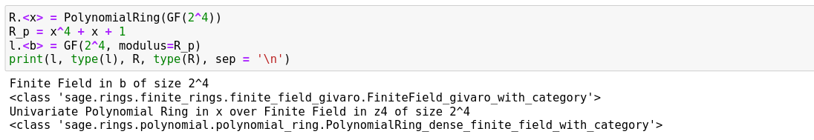
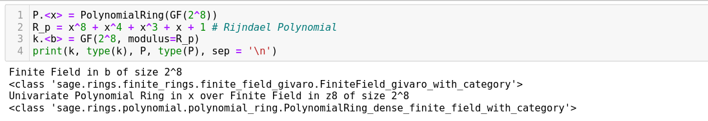
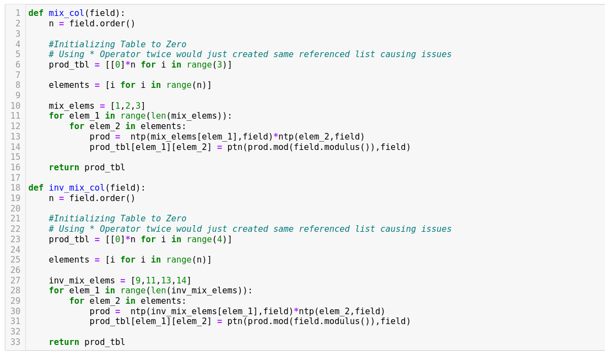
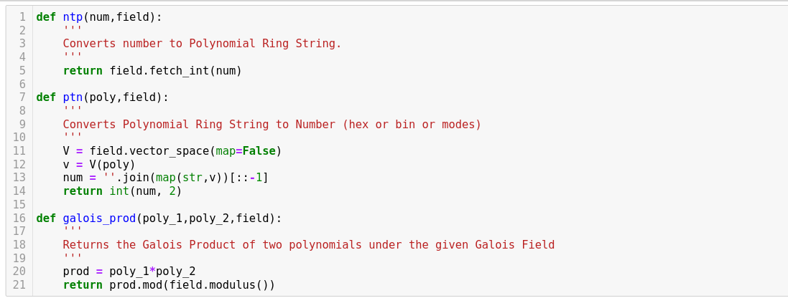
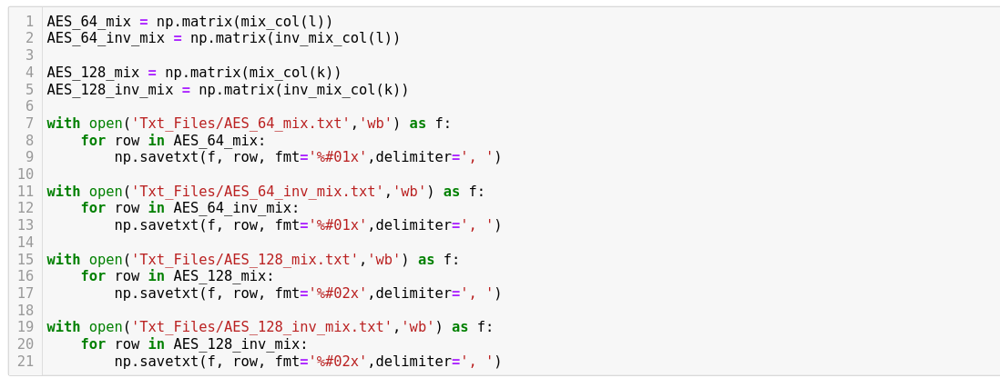
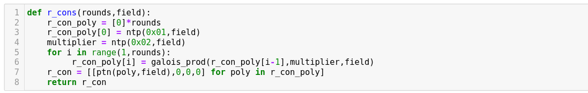
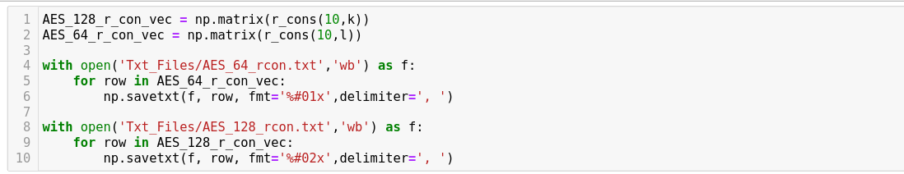

# AES-64 Components

- $\text{AES}64$ implementation is done using C and `sage` .
---
## Galois Field

- **`sage`** is used to find the Galois products.
- For $\text{AES}64$, the galois field $GF(2^4)$ with irreducible polynomial $X^4 + X + 1$ is implemented under the name $l$
    
    
    
- Similarly for $\text{AES}128$, the galois field $GF(2^8)$ with irreducible polynomial $X^8 +X^4+ X^3+ X + 1$ is implemented under the name $k$ for verification
    
    
    
---
## Mix Columns and Inverse Mix Columns

- While the $\text{MDS}$ matrix stays the same, the vector-matrix multiplication is done using Galois Field Multiplication.
- Since for Mix Columns we only need to find the possible multiplication values for $1,2,3$, we can store those values in a lookup table for making the implementation fast
- The products are found using **`sage`**
    
    
    
- Here the functions `ntp()` and `ptn()` are custom functions defined the following way
    
    
    
- These products are then stored inside text files. We use $\text{AES}128$ to verify the process, and it gives correct answer
    
    
    
---
## Round Constant

- Round Constants are also found using Galois Field Multiplication with $0\texttt{x}2$ hence we use to find the product and store them in lookup table for faster implementation.
- We use the below function for finding Round constants
    
    
    
- It is then used to store inside a text file. We use $\text{AES}128$ to verify the process, and it gives correct answer.
    
    
    

