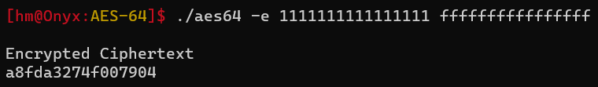
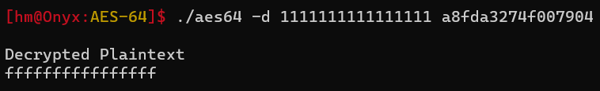

# AES-64 - Encryption and Decryption

- Now that we found the required lookup tables, we can implement $\text{AES}64$ using $C$ as this gives faster implementation
- The $C$ program has a **command line interface (CLI)** which can be used to encrypt and decrypt any given plaintext and ciphertext

### Encryption

- For encryption use the following command
    
    ```bash
    aes64 -e <master_key> <plaintext>
    ```
    
    
    
- You can also use `--verbose` optional argument to get all the round state encryption
    
    ```bash
    aes64 --verbose --encrypt <master_key> <plaintext>
    ```
    
- You can provide the Master Key or Plaintext later on as well by using the following command
    
    ```bash
    aes64 -e
    ```
    

### Decryption

- For encryption use the following command
    
    ```bash
    aes64 -e <master_key> <plaintext>
    ```
    
    
    
- You can also use `--verbose` optional argument to get all the round state encryption
    
    ```bash
    aes64 --verbose --decrypt <master_key> <ciphertext>
    ```
    
- You can provide the Master Key or Plaintext later on as well by using the following command
    
    ```bash
    aes64 -d
    ```
---
