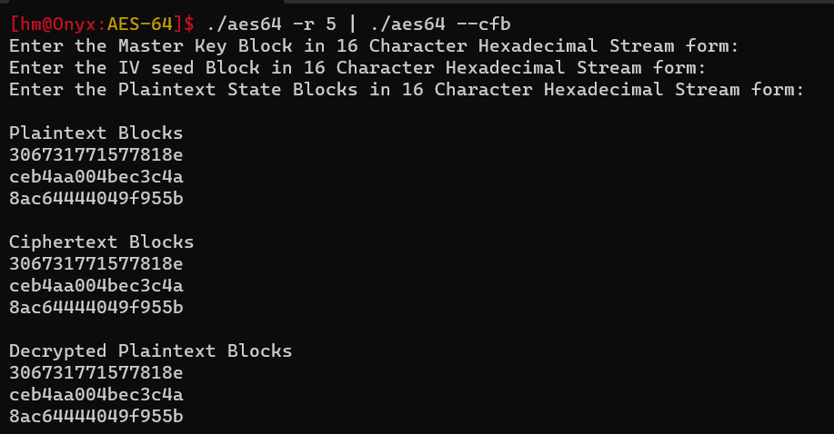
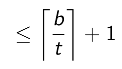
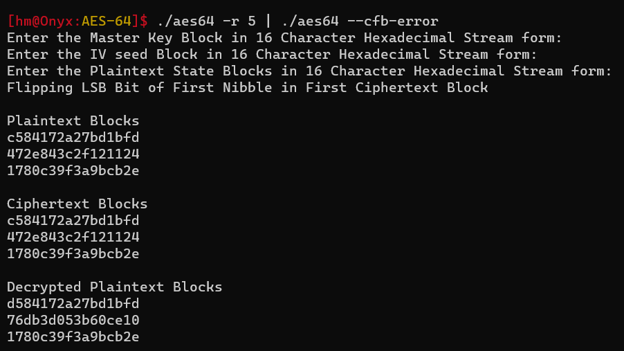

# AES-64 - CFB and CFB Error Propagation

# CFB

- $\text{CFB}64$ (without truncation) is implemented using the $C$ CLI program as well using the following command
    
    ```bash
    aes64 --cfb
    ```
    
- You can use it along with the **pseudo-random number generator** (abstraction of **`openssl rand -hex 8`** ) command to send $n>2$ number of Plaintext Blocks along with the $\text{CFB}$ command the following way
    
    ```bash
    aes64 -r <n> | aes64 --cfb
    ```
    
    - The first pseudo-random block is consumed as Master Key to encrypt
    - The next pseudo-random block is consumed as $\text{IV}$ seed which is then encrypted  using the Master Key and used as nonce.
    - The remaining pseudo-random blocks are as the Plaintext Blocks which are then encrypted in $\text{CFB}$ mode
    
    
    
- You can also use `--verbose` optional argument to get all the Plaintext, Ciphertext and Decrypted Ciphertext blocks in state matrix form
    
    ```bash
    aes64 -r <n> | aes64 --verbose --cfb
    ```
    
---
## CFB Error Propagation

- To find the error propagation without truncation, we can use the following command
    
    ```bash
    aes64 -r <n> | aes64 --cfb-error
    ```
    
    - It flips the $\text{LSB}$ of the first Nibble in the Ciphertext and sends it for decryption
- You can also use `--verbose` optional argument to get all the Plaintext, Ciphertext and Decrypted Ciphertext blocks in state matrix form
    
    ```bash
    aes64 -r <n> | aes64 --verbose --cfb-error
    ```
    
- Since there is no truncation implemented, $t = b$ where $t$ is truncation bits and $b$ is Plaintext Block Size which is $64$ bits.
- Hence the error propagation shouldn't go beyond two blocks as per the formula
$$





- As you can see in the First Decrypted Block $p_1'$, only one nibble is disturbed due to the Bit Flip in First Block of Ciphertext $c_1$.
- However the next decrypted block $p_2'$ is completely disturbed when compared to, the corresponding plaintext block $p_2$ is affected - This is due to **diffusion avalanche** $50\%$ of bits might be Flipped.
- The Last Decrypted Block $p_3'$ however remains undisturbed when compared to corresponding Plaintext Block $p_3$ as expected as the influence of the Bit Flip in $c_1$ is shifted out of the Key Stream.

---